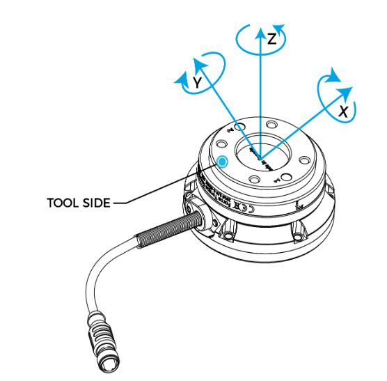

# FT300-S Data Stream

A Dockerized example to stream force/torque data from the FT300-S sensor using Python and uv.

## Prerequisites

- Docker or uv installed
- FT300-S connected via USB (e.g. `/dev/ttyUSB0`)  

> [!TIP]
> After plugging in your FT300-S, run:
> ```bash
> dmesg | grep -E 'ttyUSB|ttyACM' | tail -n 10
> ```
> to see which `/dev/tty*` device was assigned.


## Usage

Choose one of two ways to launch the stream:

### Method 1: Docker container

```bash
# 1. Build image
docker build -t uv-env .

# 2. Run container, mounting only FT300-S device
docker run --rm -it --device /dev/ttyUSB0:/dev/ttyUSB0 uv-env

# 3. Inside container, start streaming
uv run ft300s-stream.py -p /dev/ttyUSB0
```

### Method 2: Local uv install

```bash
# 1. Install uv (system or venv)
pip install uv

# 2. Grant USB access (with your device path)
sudo chmod 666 /dev/ttyUSB0

# 3. Run streaming script directly
uv run ft300s-stream.py -p /dev/ttyUSB0
```

## Others

<figure align="center">
  
  <figcaption><em>Axis orientation diagram.</em></figcaption>
</figure>


sample output of stream data from the FT 300-S at 100Hz. 
```
F: 99Hz - force Vector: [-0.16, 0.02, -0.38, 0.01, 0.01, -0.0]
F: 99Hz - force Vector: [-0.12, -0.04, -0.46, 0.01, 0.01, -0.0]
F: 99Hz - force Vector: [-0.09, -0.04, -0.48, 0.0, 0.01, -0.0]
F: 100Hz - force Vector: [-0.08, -0.07, -0.38, 0.01, 0.01, -0.0]
F: 99Hz - force Vector: [-0.09, -0.08, -0.38, 0.01, 0.01, -0.0]
F: 99Hz - force Vector: [-0.13, -0.02, -0.43, 0.01, 0.01, -0.0]
F: 100Hz - force Vector: [-0.14, -0.01, -0.42, 0.01, 0.01, -0.0]
F: 99Hz - force Vector: [-0.11, -0.06, -0.43, 0.01, 0.01, -0.0]
```

## Credits

- modified from: https://github.com/castetsb/pyFT300/blob/main/pyFT300stream.py